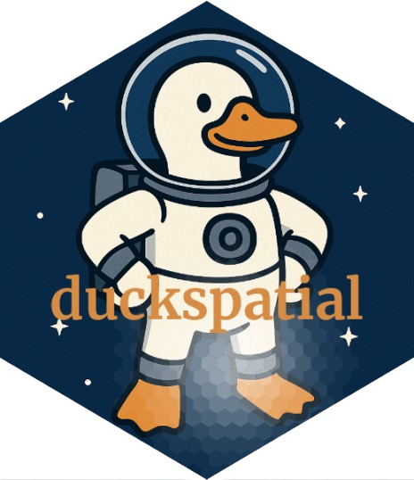

<!-- README.md is generated from README.Rmd. Please edit that file -->

```{r, include = FALSE}
knitr::opts_chunk$set(
  collapse = TRUE,
  comment = "#>",
  fig.path = "man/figures/README-",
  out.width = "100%"
)
```

# duckspatial <a href="https://cidree.github.io/duckspatial/"></a>

<!-- badges: start -->
[](https://CRAN.R-project.org/package=duckspatial)
[](https://lifecycle.r-lib.org/articles/stages.html#experimental)
[](https://app.codecov.io/gh/Cidree/duckspatial)
[](https://www.gnu.org/licenses/gpl-3.0)
[](https://www.repostatus.org/#active)
[](https://CRAN.R-project.org/package=duckspatial)
[](https://github.com/Cidree/duckspatial/actions)
<!-- badges: end -->


The **{duckspatial}** package provides fast and memory-efficient functions to 
analyze and manipulate large spatial vector datasets in R. It allows R users to 
benefit directly from the analytical power of [DuckDB and its spatial extension](https://duckdb.org/docs/stable/core_extensions/spatial/functions), 
while remaining fully compatible with R’s spatial ecosystem, especially **{sf}**.

At its core, **{duckspatial}** bridges two worlds:

- R spatial workflows based on {sf} objects
- Database-backed spatial analytics powered by DuckDB SQL

This design makes **{duckspatial}** especially well suited for:

- Working with large spatial data sets
- Speeding up spatial analysis at scale
- Workflows where data does not fit comfortably in memory

Importantly, **{duckspatial}** brings the power of DuckDB spatial to R users while
keeping workflows similar to {sf} .


# Installation

You can install duckspatial directly from CRAN with:

``` r
install.packages("duckspatial")
```

Or you can install the development version from [GitHub](https://github.com/) with:

``` r
# install.packages("pak")
pak::pak("Cidree/duckspatial")
```

# Core idea: flexible spatial workflows

A central design principle of {duckspatial} is that the same spatial operation 
can be used in different ways, depending on how your data is stored and how you 
want to manage memory and performance.

Most functions in {duckspatial} support four complementary workflows:

1. Input`sf` → Output `sf`
4. Input `sf` → Output DuckDB table
2. Input DuckDB table → Output `sf`
3. Input DuckDB table → Output DuckDB table

See the ["Get Started" vignette for examples](https://Cidree.github.io/duckspatial/articles/duckspatial.html).

