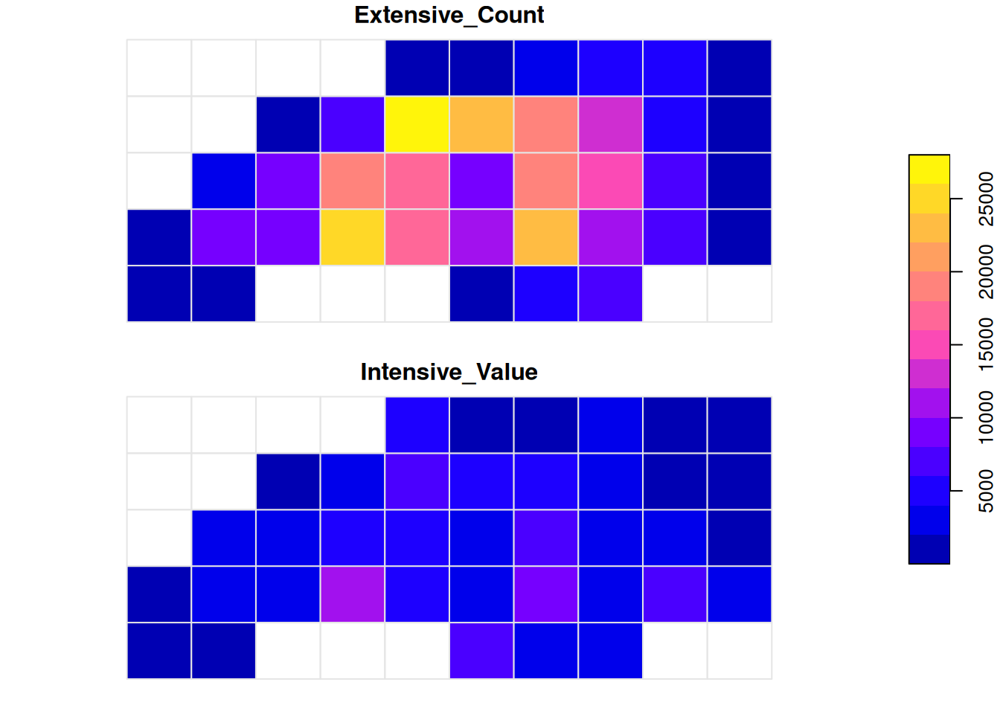

# Areal Interpolation

This vignette demonstrates how to use
[`ddbs_interpolate_aw()`](https://cidree.github.io/duckspatial/reference/ddbs_interpolate_aw.md)
to perform areal-weighted interpolation. This technique is essential
when you need to transfer attributes from one set of polygons (source)
to another incongruent set of polygons (target) based on their area of
overlap.

[`ddbs_interpolate_aw()`](https://cidree.github.io/duckspatial/reference/ddbs_interpolate_aw.md)
can be 9-30x faster than
[`sf::st_interpolate_aw`](https://r-spatial.github.io/sf/reference/interpolate_aw.html)
or
[`areal::aw_interpolate`](https://chris-prener.github.io/areal/reference/aw_interpolate.html)
(see benchmarks in [`{ducksf}`](https://www.ekotov.pro/ducksf/) where
prototype of
[`ddbs_interpolate_aw()`](https://cidree.github.io/duckspatial/reference/ddbs_interpolate_aw.md)
was originally developed).

`duckspatial` handles these heavy geometric calculations efficiently
using DuckDB. We will cover three scenarios:

1.  **Extensive vs. Intensive**: Understanding the difference between
    mass-preserving counts and densities.
2.  **Fast Output**: Returning a `tibble` (no geometry) for maximum
    speed.
3.  **Database Mode**: Performing operations on persistent database
    tables.

### Setup Data

We will use the North Carolina dataset from the `sf` package as our
**source**, and create a generic grid as our **target**.

*Note: We project the data to Albers Equal Area (EPSG:5070) because
accurate interpolation requires an equal-area projection.*

``` r
library(duckspatial)
library(sf)

# 1. Load Source Data (NC Counties)
nc <- st_read(system.file("shape/nc.shp", package = "sf"), quiet = TRUE)

# 2. Transform to projected CRS (Albers) for accurate area calculations
nc <- st_transform(nc, 5070)

# 3. Create a Target Grid
grid <- st_make_grid(nc, n = c(10, 5)) |> st_as_sf()

# 4. Create Unique IDs (Required for interpolation)
nc$source_id <- 1:nrow(nc)
grid$target_id <- 1:nrow(grid)
```

## 1) Extensive vs. Intensive Interpolation

Areal interpolation works differently depending on the nature of the
data.

### Case A: Extensive Variables (Counts)

Variables like population counts or total births (`BIR74`) are
**spatially extensive**. If a source polygon is split in half, the count
should also be split in half. We use `weight = "total"` to ensure strict
mass preservation relative to the source.

``` r
# Interpolate Total Births (Extensive)
res_extensive <- ddbs_interpolate_aw(
  target = grid,
  source = nc,
  tid = "target_id",
  sid = "source_id",
  extensive = "BIR74",
  weight = "total",
  mode = "sf"
)
```

**Verification:** The total sum of births in the result should match the
original data (mass preservation).

``` r
orig_sum <- sum(nc$BIR74)
new_sum  <- sum(res_extensive$BIR74, na.rm = TRUE)

sprintf("Original: %s | Interpolated: %s", orig_sum, round(new_sum, 1))
#> [1] "Original: 329962 | Interpolated: 329962"
```

### Case B: Intensive Variables (Densities/Ratios)

Variables like population density or infection rates are **spatially
intensive**. If a source polygon is split, the density remains the same
in both pieces. `duckspatial` handles this by calculating the
area-weighted average.

``` r
# Interpolate 'BIR74' treating it as an intensive variable (e.g. density assumption)
res_intensive <- ddbs_interpolate_aw(
  target = grid,
  source = nc,
  tid = "target_id",
  sid = "source_id",
  intensive = "BIR74", # Treated as density here
  weight = "sum",      # Standard behavior for intensive vars
  mode = "sf"
)
```

### Visual Comparison

Notice the difference in patterns. Extensive interpolation accumulates
values based on how much “stuff” falls into a grid cell, while intensive
interpolation smoothes the values based on overlap.

``` r
# Combine for plotting
plot_data <- res_extensive[, "BIR74"]
names(plot_data)[1] <- "Extensive_Count"
plot_data$Intensive_Value <- res_intensive$BIR74

plot(plot_data[c("Extensive_Count", "Intensive_Value")], 
     main = "Interpolation Methods Comparison",
     border = "grey90",
     key.pos = 4)
```



## 2) High Performance: Output as Tibble

If you are working with massive datasets, constructing the geometry for
the result `sf` object can be slow. If you only need the interpolated
numbers, collect the default `duckspatial_df` using
`ddbs_collect(as = "tibble")`. This skips the geometry construction step
and is significantly faster.

``` r
# Return a standard data.frame/tibble without geometry
res_tbl <- ddbs_interpolate_aw(
  target = grid,
  source = nc,
  tid = "target_id",
  sid = "source_id",
  extensive = "BIR74"
) |> 
  ddbs_collect(as = "tibble")

head(res_tbl)
#> # A tibble: 6 × 2
#>   target_id BIR74
#>       <int> <dbl>
#> 1         1 1168.
#> 2         2  379.
#> 3         6  753.
#> 4         7 5731.
#> 5         8 8000.
#> 6        11 1417.
```

## 3) Database Mode: Large Data Workflows

For datasets larger than memory, or for persistent pipelines, you can
perform the interpolation directly inside the DuckDB database without
pulling data into R until the end.

First, let’s establish a connection and load our spatial layers into
tables.

``` r
# Create connection
conn <- ddbs_create_conn()

# Write layers to DuckDB
ddbs_write_vector(conn, nc, "nc_table", overwrite = TRUE)
#> Warning: `ddbs_write_vector()` was deprecated in duckspatial 1.0.0.
#> ℹ Please use `ddbs_write_table()` instead.
#> ℹ Table <nc_table> dropped
#> ✔ Table nc_table successfully imported
ddbs_write_vector(conn, grid, "grid_table", overwrite = TRUE)
#> ℹ Table <grid_table> dropped
#> ✔ Table grid_table successfully imported
```

Now we run the interpolation by referencing the table names. We can also
use the `name` argument to save the result directly to a new table
instead of returning it to R.

``` r
# Run interpolation and save to new table 'nc_grid_births'
ddbs_interpolate_aw(
  conn = conn,
  target = "grid_table",
  source = "nc_table",
  tid = "target_id",
  sid = "source_id",
  extensive = "BIR74",
  weight = "total",
  name = "nc_grid_births", # <--- Writes to DB
  overwrite = TRUE
)
#> ℹ Table <nc_grid_births> dropped
#> ✔ Query successful

# Verify the table was created
DBI::dbListTables(conn)
#> [1] "grid_table"     "nc_grid_births" "nc_table"
```

We can now query this table or read it back later.

``` r
# Read the result back from the database
final_sf <- ddbs_read_vector(conn, "nc_grid_births")
#> Warning: `ddbs_read_vector()` was deprecated in duckspatial 1.0.0.
#> ℹ Please use `ddbs_read_table()` instead.
#> ✔ table nc_grid_births successfully imported.

head(final_sf)
#> Simple feature collection with 6 features and 2 fields
#> Geometry type: POLYGON
#> Dimension:     XY
#> Bounding box:  xmin: 1054293 ymin: 1348021 xmax: 1677656 ymax: 1484503
#> Projected CRS: NAD83 / Conus Albers
#>   target_id     BIR74                              x
#> 1         1 1168.3093 POLYGON ((1054293 1348021, ...
#> 2         2  378.5281 POLYGON ((1132214 1348021, ...
#> 3         6  752.9156 POLYGON ((1443895 1348021, ...
#> 4         7 5731.0103 POLYGON ((1521815 1348021, ...
#> 5         8 7999.6957 POLYGON ((1599735 1348021, ...
#> 6        11 1416.5579 POLYGON ((1054293 1416262, ...
```

If we only wanted the database table, without the geometry, we could do:

``` r
ddbs_interpolate_aw(
  conn = conn,
  target = "grid_table",
  source = "nc_table",
  tid = "target_id",
  sid = "source_id",
  extensive = "BIR74",
  weight = "total",
  name = "nc_grid_births", # <--- Writes to DB
  overwrite = TRUE,
  mode = "tibble"
)
#> ℹ Table <nc_grid_births> dropped
#> ✔ Query successful
```

And preview this table directly in the database:

``` r
as_duckspatial_df("nc_grid_births", conn)
#> # A duckspatial lazy spatial table
#> # ● CRS: EPSG:5070 
#> # ● Geometry column: x 
#> # ● Geometry type: POLYGON 
#> # ● Bounding box: xmin: 1.0543e+06 ymin: 1.348e+06 xmax: 1.8335e+06 ymax: 1.6892e+06 
#> # Data backed by DuckDB (dbplyr lazy evaluation)
#> # Use ddbs_collect() or st_as_sf() to materialize to sf
#> #
#> # Source:   table<nc_grid_births> [?? x 3]
#> # Database: DuckDB 1.5.1 [unknown@Linux 6.17.0-1008-azure:R 4.5.3/:memory:]
#>    target_id x                                                             BIR74
#>        <int> <wk_wkb>                                                      <dbl>
#>  1         1 <POLYGON ((1054293 1348021, 1132214 1348021, 1132214 141626…  1168.
#>  2         2 <POLYGON ((1132214 1348021, 1210134 1348021, 1210134 141626…   379.
#>  3         6 <POLYGON ((1443895 1348021, 1521815 1348021, 1521815 141626…   753.
#>  4         7 <POLYGON ((1521815 1348021, 1599735 1348021, 1599735 141626…  5731.
#>  5         8 <POLYGON ((1599735 1348021, 1677656 1348021, 1677656 141626…  8000.
#>  6        11 <POLYGON ((1054293 1416262, 1132214 1416262, 1132214 148450…  1417.
#>  7        12 <POLYGON ((1132214 1416262, 1210134 1416262, 1210134 148450…  8314.
#>  8        13 <POLYGON ((1210134 1416262, 1288054 1416262, 1288054 148450…  8305.
#>  9        14 <POLYGON ((1288054 1416262, 1365975 1416262, 1365975 148450… 25694.
#> 10        15 <POLYGON ((1365975 1416262, 1443895 1416262, 1443895 148450… 17277.
#> # ℹ more rows
```

### Cleanup

Always close the connection when finished.

``` r
duckdb::dbDisconnect(conn)
```
