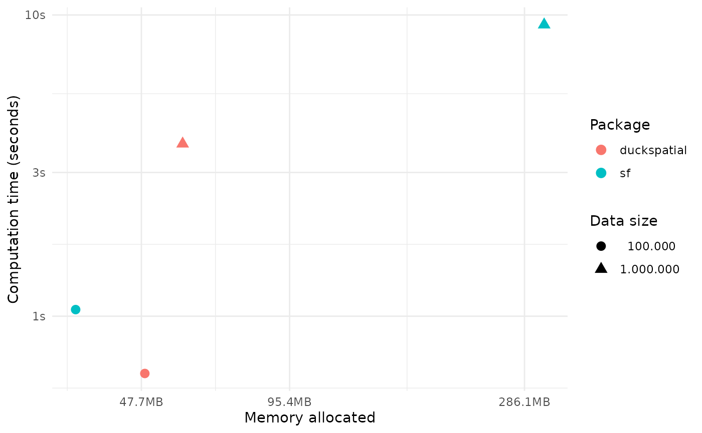
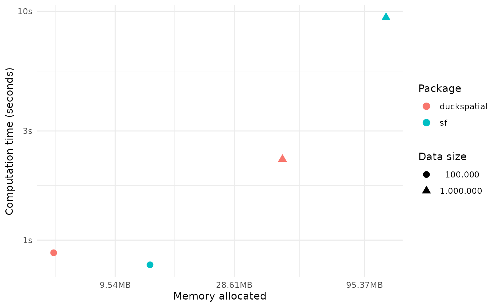
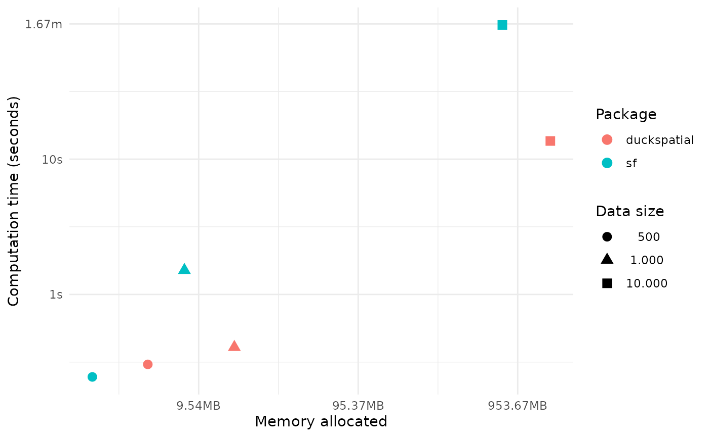

# Benchmark

This vignette shows a few benchmarks comparing **{duckspatial}** vs
**{sf}**. We look at how both packages compare in terms of computation
time and memory use when performing different spatial operations with
increasingly large data sets. We plan to extend this vignette in the
future to benchmark other types of spatial operations.

### TL;DR

- {duckspatial} is substantially faster and uses way less memory than
  {sf} in pretty much all cases, particularly when working with large
  data sets

### Prepare data for benchmark

This chunk of code below loads a few libraries and create a few sample
data sets used in this benchmark.

``` r
library(duckspatial)
library(bench)
library(dplyr)
library(sf)
library(lwgeom)
library(ggplot2)
options(scipen = 999)

# read polygons data
countries_sf <- sf::st_read(system.file("spatial/countries.geojson", package = "duckspatial"))
#> Reading layer `countries' from data source 
#>   `/home/runner/work/_temp/Library/duckspatial/spatial/countries.geojson' 
#>   using driver `GeoJSON'
#> Simple feature collection with 257 features and 6 fields
#> Geometry type: POLYGON
#> Dimension:     XY
#> Bounding box:  xmin: -178.9125 ymin: -89.9 xmax: 180 ymax: 83.65187
#> Geodetic CRS:  WGS 84

# generate random points
set.seed(42)

## create points data
n = 10e4
points_sf_100k <- data.frame(
    id = 1:n,
    x = runif(n, min = -180, max = 180),  
    y = runif(n, min = -90, max = 90)
    ) |> 
    sf::st_as_sf(coords = c("x", "y"), crs = 4326)

n = 10e5
points_sf_1mi <- data.frame(
    id = 1:n,
    x = runif(n, min = -180, max = 180),  
    y = runif(n, min = -90, max = 90)
    ) |> 
    sf::st_as_sf(coords = c("x", "y"), crs = 4326)

# n = 10e6
# points_sf_10mi <- data.frame(
#     id = 1:n,
#     x = runif(n, min = -180, max = 180),  
#     y = runif(n, min = -90, max = 90)
#     ) |> 
#     sf::st_as_sf(coords = c("x", "y"), crs = 4326)
```

## Spatial Join

``` r
run_benchmark <- function(points_sf){
    
    temp_bench <- bench::mark(
        iterations = 1, 
        check = FALSE, 
        duckspatial = duckspatial::ddbs_join(
            x = points_sf, 
            y = countries_sf, 
            join = "within"),
        
        sf = sf::st_join(
            x = points_sf, 
            y = countries_sf, 
            join = sf::st_within)
        )
    
    temp_bench$n <- nrow(points_sf)
    temp_bench$pkg <- c("duckspatial", "sf")
    
    return(temp_bench)
}

# From 100K points to 1 million and 10 million points
df_bench_join <- lapply(
    X = list(points_sf_100k, points_sf_1mi),
    FUN = run_benchmark
    ) |> 
    dplyr::bind_rows()
#> Warning: Some expressions had a GC in every iteration; so filtering is
#> disabled.
#> Warning: Some expressions had a GC in every iteration; so filtering is
#> disabled.


# calculate difference in performance
temp <- df_bench_join |> 
    filter(n == 10e5)

memo_diff <- round(as.numeric(temp$mem_alloc[2] / temp$mem_alloc[1]),1)
time_diff <- (1 - round(as.numeric(temp$median[1] / temp$median[2]),2))*100
```

In this example working with 1 million points, {duckspatial} was 57%
faster and used 5.4 times less memory than {sf}. Not bad.

``` r
ggplot(data = df_bench_join) +
    geom_point(size =3, aes(x= mem_alloc, y = median, color = pkg, 
                    shape = format(n, big.mark = ".")
                    )) +
    labs(color= "Package", shape = "Data size",
         y = "Computation time (seconds)",
         x = "Memory allocated") +
    theme_minimal()
```



## Spatial filter

``` r
run_benchmark <- function(points_sf){
    
    temp_bench <- bench::mark(
        iterations = 1, 
        check = FALSE, 
        duckspatial = duckspatial::ddbs_filter(
            x = points_sf, 
            y = countries_sf),
        
        sf = sf::st_filter(
            x = points_sf, 
            y = countries_sf)
        )
    
    temp_bench$n <- nrow(points_sf)
    temp_bench$pkg <- c("duckspatial", "sf")
    
    return(temp_bench)
}


# From 100K points to 1 million and 10 million points
df_bench_filter <- lapply(
    X = list(points_sf_100k, points_sf_1mi),
    FUN = run_benchmark
    ) |> 
    dplyr::bind_rows()
#> Warning: Some expressions had a GC in every iteration; so filtering is
#> disabled.


# calculate difference in performance
temp <- df_bench_filter |> 
    filter(n == 10e5)

memo_diff <- round(as.numeric(temp$mem_alloc[2] / temp$mem_alloc[1]),1)
time_diff <- (1 - round(as.numeric(temp$median[1] / temp$median[2]),2))*100
```

In this example working with 1 million points, {duckspatial} was 64%
faster and used 2.7 times less memory than {sf}.

plot

``` r
ggplot(data = df_bench_filter) +
    geom_point(size =3, aes(x= mem_alloc, y = median, color = pkg, 
                    shape = format(n, big.mark = ".")
                    )) +
    labs(color= "Package", shape = "Data size",
         y = "Computation time (seconds)",
         x = "Memory allocated") +
    theme_minimal()
```



## Spatial distances

``` r
# Turn on S2 (Spherical geometry)
sf::sf_use_s2(TRUE)

run_benchmark <- function(n){
    
    set.seed(42)

    ## create points data
    points_sf <- data.frame(
        id = 1:n,
        x = runif(n, min = -180, max = 180),  
        y = runif(n, min = -90, max = 90)
        ) |> 
        sf::st_as_sf(coords = c("x", "y"), crs = 4326)
    
    temp_bench <- bench::mark(
        iterations = 1, 
        check = FALSE, 
        duckspatial = duckspatial::ddbs_distance(
            x = points_sf, 
            y = points_sf, 
            dist_type = "haversine"),
        
        sf = sf::st_distance(
            x = points_sf, 
            y = points_sf, 
            which = "Great Circle")
        )
    
    temp_bench$n <- nrow(points_sf)
    temp_bench$pkg <- c("duckspatial", "sf")
    
    return(temp_bench)
}


# From 100K points to 1 million and 10 million points
df_bench_distance <- lapply(
    X = c(500, 1000, 10000),
    FUN = run_benchmark
    ) |> 
    dplyr::bind_rows()
#> Warning: Some expressions had a GC in every iteration; so filtering is
#> disabled.
#> Warning: Some expressions had a GC in every iteration; so filtering is
#> disabled.
#> Warning: Some expressions had a GC in every iteration; so filtering is
#> disabled.


# calculate difference in performance
temp <- df_bench_distance |> 
    filter(n == 10000)

memo_diff <- round(as.numeric(temp$mem_alloc[1]) / as.numeric(temp$mem_alloc[2]) ,1)
time_diff <- (1 - round(as.numeric(temp$median[1] / temp$median[2]),2))*100
```

In this example calculating the distance between 10K points,
{duckspatial} was 86% faster, but used 2 times more memory than {sf}.
Mind you that {sf} is still more efficient when calculating Euclidean
distances.

plot

``` r
ggplot(data = df_bench_distance) +
    geom_point(size =3, aes(x= mem_alloc, y = median, color = pkg, 
                    shape = format(n, big.mark = ".")
                    )) +
    labs(color= "Package", shape = "Data size",
         y = "Computation time (seconds)",
         x = "Memory allocated") +
    theme_minimal()
```


