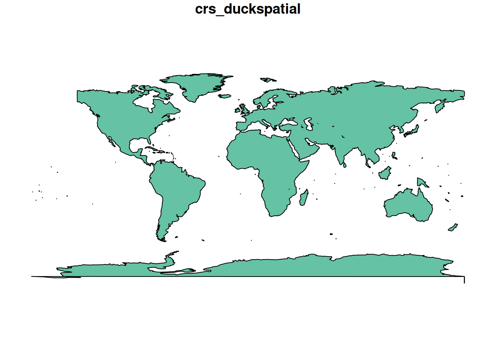
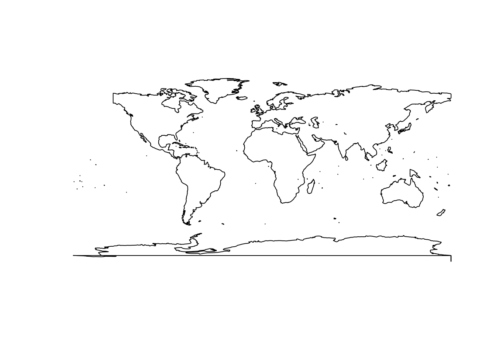

# Getting started

## Getting started

**{duckspatial}** provides fast, memory-efficient functions for
analysing and manipulating large spatial vector datasets in R. It
bridges [DuckDB’s spatial
extension](https://duckdb.org/docs/stable/core_extensions/spatial/functions)
with R’s spatial ecosystem — in particular **{sf}** — so you can
leverage DuckDB’s analytical power without leaving your familiar R
workflow.

Let’s start by loading the packages we need:

``` r
library(duckdb)
library(duckspatial)
library(dplyr)
library(sf)
```

## Installation

Install the stable release from CRAN:

``` r
# install.packages("pak")
pak::pak("duckspatial")
```

Install the latest GitHub version (more features, fewer accumulated
bugs):

``` r
pak::pak("Cidree/duckspatial")
```

Install the development version (may be unstable):

``` r
pak::pak("Cidree/duckspatial@dev")
```

## Reading data

{duckspatial} is built around the `duckspatial_df` S3 class: a
lazy-table-like object that holds a geometry column alongside its
geospatial properties, but keeps the data **outside R’s memory** until
you explicitly ask for it.

If you have a local file (a GeoPackage, a Shapefile, a GeoJSON, etc.)
you can open it lazily with
[`ddbs_open_dataset()`](https://cidree.github.io/duckspatial/reference/ddbs_open_dataset.md):

``` r
countries_ddbs <- ddbs_open_dataset(
  system.file(
    "spatial/countries.geojson",
    package = "duckspatial"
  )
)

print(countries_ddbs)
#> # A duckspatial lazy spatial table
#> # ● CRS: EPSG:4326 
#> # ● Geometry column: geom 
#> # ● Geometry type: POLYGON 
#> # ● Bounding box: xmin: -178.91 ymin: -89.9 xmax: 180 ymax: 83.652 
#> # Data backed by DuckDB (dbplyr lazy evaluation)
#> # Use ddbs_collect() or st_as_sf() to materialize to sf
#> #
#> # Source:   table<temp_view_2fbac87b_b83a_4fc4_b1c1_83e88f2c6b04> [?? x 8]
#> # Database: DuckDB 1.5.1 [unknown@Linux 6.17.0-1008-azure:R 4.5.3/:memory:]
#>    OGC_FID CNTR_ID NAME_ENGL          ISO3_CODE CNTR_NAME FID   date       geom 
#>      <dbl> <chr>   <chr>              <chr>     <chr>     <chr> <date>     <wk_>
#>  1       0 AR      Argentina          ARG       Argentina AR    2021-01-01 <POL…
#>  2       1 AS      American Samoa     ASM       American… AS    2021-01-01 <POL…
#>  3       2 AT      Austria            AUT       Österrei… AT    2021-01-01 <POL…
#>  4       3 AQ      Antarctica         ATA       Antarcti… AQ    2021-01-01 <POL…
#>  5       4 AD      Andorra            AND       Andorra   AD    2021-01-01 <POL…
#>  6       5 AE      United Arab Emira… ARE       ????????… AE    2021-01-01 <POL…
#>  7       6 AF      Afghanistan        AFG       ????????… AF    2021-01-01 <POL…
#>  8       7 AG      Antigua and Barbu… ATG       Antigua … AG    2021-01-01 <POL…
#>  9       8 AI      Anguilla           AIA       Anguilla  AI    2021-01-01 <POL…
#> 10       9 AL      Albania            ALB       Shqipëria AL    2021-01-01 <POL…
#> # ℹ more rows
```

> **Note:** The first call to
> [`ddbs_open_dataset()`](https://cidree.github.io/duckspatial/reference/ddbs_open_dataset.md)
> may take a few seconds. Internally, {duckspatial} creates a default
> DuckDB connection, then installs and loads the Spatial extension into
> it. Subsequent calls reuse the same connection and are much faster. We
> cover this connection in more detail in the [Working in a
> database](#working-in-a-database) section below.

Printing a `duckspatial_df` object displays the most important metadata
at a glance:

| Field               | Description                                               |
|---------------------|-----------------------------------------------------------|
| **CRS**             | Coordinate reference system (AUTHORITY:CODE)              |
| **Geometry column** | Name of the column holding geometries                     |
| **Geometry type**   | Type(s) present (e.g. `POLYGON`, `MULTIPOLYGON`, `POINT`) |
| **Bounding box**    | Four coordinates bounding all geometries                  |
| **Source**          | Name of the temporary view inside DuckDB                  |
| **Database**        | DuckDB database path and version                          |
| **Data**            | First rows of the dataset                                 |

The table is not in R’s memory; it lives inside the DuckDB connection.
Every {duckspatial} operation you apply runs there, using the DuckDB
engine.

Alternatively, if you already have an `sf` object in memory, you can
convert it to a `duckspatial_df` with
[`as_duckspatial_df()`](https://cidree.github.io/duckspatial/reference/as_duckspatial_df.md):

``` r
## read with sf as usual
countries_sf <- read_sf(
  system.file(
    "spatial/countries.geojson",
    package = "duckspatial"
  )
)

## push into DuckDB
countries_ddbs <- as_duckspatial_df(countries_sf)

class(countries_ddbs)
#> [1] "duckspatial_df"        "tbl_duckdb_connection" "tbl_dbi"              
#> [4] "tbl_sql"               "tbl_lazy"              "tbl"
```

## Processing data

Let’s run a typical spatial workflow: dissolving all country polygons
into a single `MULTIPOLYGON` with internal boundaries removed, using
[`ddbs_union()`](https://cidree.github.io/duckspatial/reference/ddbs_union_funs.md)
(the {duckspatial} equivalent of
[`sf::st_union()`](https://r-spatial.github.io/sf/reference/geos_combine.html)).

[`ddbs_union()`](https://cidree.github.io/duckspatial/reference/ddbs_union_funs.md)
requires all geometries to be valid. We can check this first with
[`ddbs_is_valid()`](https://cidree.github.io/duckspatial/reference/ddbs_geom_validation_funs.md)
(equivalent to
[`sf::st_is_valid()`](https://r-spatial.github.io/sf/reference/valid.html)),
which appends a logical `is_valid` column to the lazy table so the
subsequent
[`filter()`](https://dplyr.tidyverse.org/reference/filter.html) also
runs inside DuckDB:

``` r
countries_ddbs |>
  ddbs_is_valid() |>
  filter(!is_valid)
#> # A duckspatial lazy spatial table
#> # ● CRS: EPSG:4326 
#> # ● Geometry column: geometry 
#> # ● Geometry type: POLYGON 
#> # ● Bounding box: xmin: -178.91 ymin: -89.9 xmax: 180 ymax: -63.281 
#> # Data backed by DuckDB (dbplyr lazy evaluation)
#> # Use ddbs_collect() or st_as_sf() to materialize to sf
#> #
#> # Source:   table<temp_view_5fc2ae21_f665_493f_81fa_51d077aed986> [?? x 8]
#> # Database: DuckDB 1.5.1 [unknown@Linux 6.17.0-1008-azure:R 4.5.3/:memory:]
#>   CNTR_ID NAME_ENGL  ISO3_CODE CNTR_NAME  FID   date       is_valid geometry    
#>   <chr>   <chr>      <chr>     <chr>      <chr> <date>     <lgl>    <wk_wkb>    
#> 1 AQ      Antarctica ATA       Antarctica AQ    2021-01-01 FALSE    <POLYGON ((…
```

Antarctica has invalid geometries (likely self-intersections). We can
repair them with
[`ddbs_make_valid()`](https://cidree.github.io/duckspatial/reference/ddbs_make_valid.md)
before computing the union, and because `duckspatial_df` objects are
lazy, we can chain both steps in a single pipe:

``` r
world_ddbs <- countries_ddbs |>
  ddbs_make_valid() |>
  ddbs_union()

print(world_ddbs)
#> # A duckspatial lazy spatial table
#> # ● CRS: EPSG:4326 
#> # ● Geometry column: geometry 
#> # ● Geometry type: MULTIPOLYGON 
#> # ● Bounding box: xmin: -178.91 ymin: -89.9 xmax: 180 ymax: 83.652 
#> # Data backed by DuckDB (dbplyr lazy evaluation)
#> # Use ddbs_collect() or st_as_sf() to materialize to sf
#> #
#> # Source:   table<temp_view_490f37ef_30e8_4ac3_8205_5eede67c545b> [?? x 1]
#> # Database: DuckDB 1.5.1 [unknown@Linux 6.17.0-1008-azure:R 4.5.3/:memory:]
#>   geometry                                                                      
#>   <wk_wkb>                                                                      
#> 1 <MULTIPOLYGON (((-148.8727 -85.21352, -150.1968 -85.49222, -151.2143 -85.4843…
```

The result is still a lazy `duckspatial_df`. To visualise it we need to
pull the data into R as an `sf` object. Any of the following three calls
do that:

``` r
# Option A
world_sf <- ddbs_collect(world_ddbs)

# Option B
world_sf <- collect(world_ddbs)

# Option C
world_sf <- st_as_sf(world_ddbs)
```

``` r
world_sf <- world_ddbs |>
  ddbs_collect()

print(world_sf)
#> Simple feature collection with 1 feature and 0 fields
#> Geometry type: MULTIPOLYGON
#> Dimension:     XY
#> Bounding box:  xmin: -178.9125 ymin: -89.9 xmax: 180 ymax: 83.65187
#> Geodetic CRS:  WGS 84
#> # A tibble: 1 × 1
#>                                                                         geometry
#> *                                                             <MULTIPOLYGON [°]>
#> 1 (((-148.8727 -85.21352, -150.1968 -85.49222, -151.2143 -85.48437, -151.7571 -…
```

``` r
plot(world_sf)
```



## Working in a database

So far we have been using the default, temporary DuckDB connection that
{duckspatial} manages for us. For some use cases you may want to manage
the connection yourself, most commonly when you need a **persistent
database** that survives the R session.

There are two connection modes:

- **Non-persistent (in-memory):** data exists only for the duration of
  the R session or until it is closed. As of v1.0.0, this mode is kept
  for backward compatibility, but working with `duckspatial_df` objects
  directly achieves the same goals with less boilerplate.
- **Persistent:** data is written to a `.duckdb` or `.db` file on disk
  and survives after the session ends.

### Creating a connection

{duckspatial} provides a convenience wrapper,
[`ddbs_create_conn()`](https://cidree.github.io/duckspatial/reference/ddbs_create_conn.md),
that creates a DuckDB connection, installs the Spatial extension, and
loads it, all in one call:

``` r
conn <- ddbs_create_conn()
```

You can also limit the resources DuckDB is allowed to use:

``` r
conn <- ddbs_create_conn(
  threads         = 2,
  memory_limit_gb = 8
)
```

Under the hood,
[`ddbs_create_conn()`](https://cidree.github.io/duckspatial/reference/ddbs_create_conn.md)
is equivalent to:

``` r
conn <- dbConnect(duckdb())
ddbs_install(conn)
ddbs_load(conn)
```

### Non-persistent database

Once you have a connection, write spatial data into it with
[`ddbs_write_table()`](https://cidree.github.io/duckspatial/reference/ddbs_write_table.md).
It accepts both `sf` and `duckspatial_df` objects:

``` r
ddbs_write_table(conn, countries_sf, name = "countries")
#> ✔ Table countries successfully imported
```

Verify the table is there:

``` r
ddbs_list_tables(conn)
#>   table_schema table_name table_type
#> 1         main  countries BASE TABLE
```

From here the workflow mirrors the `duckspatial_df` workflow. Functions
that accept a `duckspatial_df` also accept a table name + connection
pair:

``` r
ddbs_is_valid("countries", conn = conn) |>
  filter(!is_valid)
#> # A duckspatial lazy spatial table
#> # ● CRS: EPSG:4326 
#> # ● Geometry column: geometry 
#> # ● Geometry type: POLYGON 
#> # ● Bounding box: xmin: -178.91 ymin: -89.9 xmax: 180 ymax: -63.281 
#> # Data backed by DuckDB (dbplyr lazy evaluation)
#> # Use ddbs_collect() or st_as_sf() to materialize to sf
#> #
#> # Source:   table<temp_view_9d0f9c4f_d88e_4b85_94bf_426c7d142dbb> [?? x 8]
#> # Database: DuckDB 1.5.1 [unknown@Linux 6.17.0-1008-azure:R 4.5.3/:memory:]
#>   CNTR_ID NAME_ENGL  ISO3_CODE CNTR_NAME  FID   date       is_valid geometry    
#>   <chr>   <chr>      <chr>     <chr>      <chr> <date>     <lgl>    <wk_wkb>    
#> 1 AQ      Antarctica ATA       Antarctica AQ    2021-01-01 FALSE    <POLYGON ((…
```

You can write intermediate results as named tables in the database by
passing a `name` argument:

``` r
ddbs_make_valid("countries", conn = conn, name = "countries_valid")
#> ✔ Query successful
ddbs_union("countries_valid", conn = conn, name = "world")
#> ✔ Query successful
```

[`ddbs_read_table()`](https://cidree.github.io/duckspatial/reference/ddbs_read_table.md)
materialises a table directly as `sf` (not lazily), so the result can be
passed straight to
[`plot()`](https://rspatial.github.io/terra/reference/plot.html):

``` r
ddbs_read_table(conn, "world") |>
  plot()
#> ✔ table world successfully imported.
```



When you are done, close the connection. Because this is an in-memory
database, all tables written to it will be discarded:

``` r
ddbs_stop_conn(conn)
```

### Persistent database

The workflow is identical to the non-persistent case. The only
difference is the connection string, pass a file path to
[`ddbs_create_conn()`](https://cidree.github.io/duckspatial/reference/ddbs_create_conn.md):

``` r
conn <- ddbs_create_conn("my_database.duckdb")
```

A practical pattern is to do all processing with the `duckspatial_df`
workflow (which is lazily evaluated inside the default connection), and
only write the final results to the persistent database:

``` r
## open persistent connection
conn <- ddbs_create_conn("my_database.duckdb")

## do all processing with duckspatial_df objects
world_ddbs <- ddbs_open_dataset(
    system.file("spatial/countries.geojson", package = "duckspatial")
  ) |>
  ddbs_make_valid() |>
  ddbs_union()

## write only the final result to the persistent database
ddbs_write_table(conn, world_ddbs, name = "world")

## close — "my_database.duckdb" will persist on disk
ddbs_stop_conn(conn)
```
