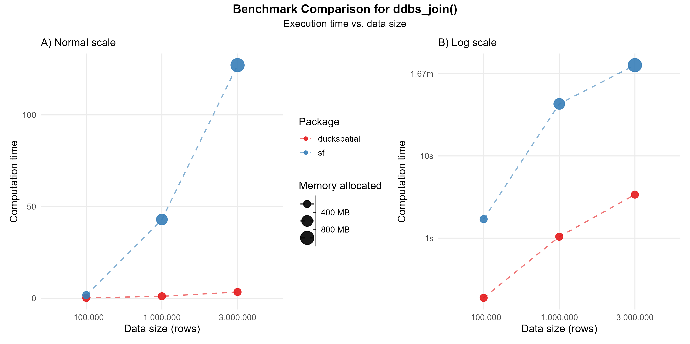
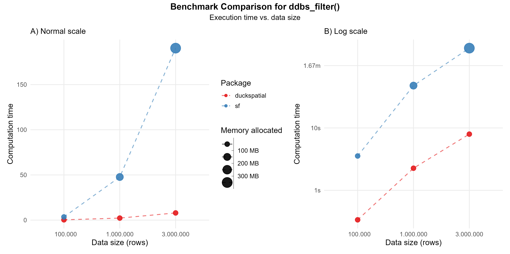
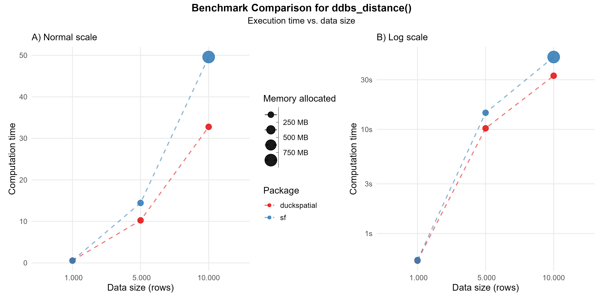
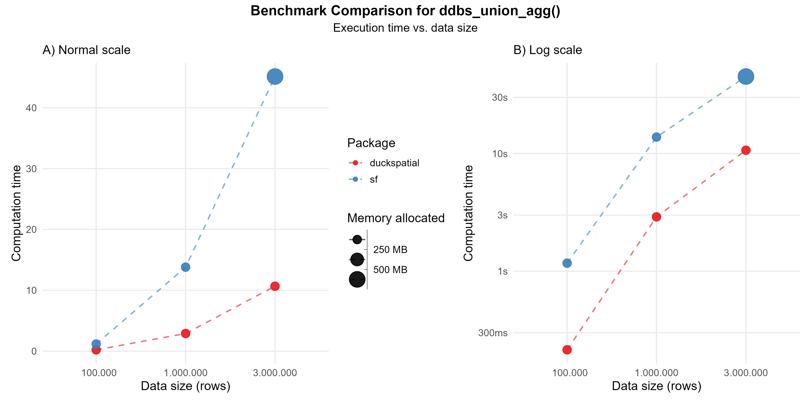

```{r}
#| include: false

# Limit threads to avoid a CRAN NOTE
Sys.setenv(OMP_THREAD_LIMIT = 2)
```

```{r}
#| echo: false

## Internal packages
library(patchwork)

## Functions used in the vignette
ggplot_benchmark <- function(
  data, 
  log = FALSE,
  show.legend = TRUE,
  ...
  ) {

    ## Generate base plot
    ggplot(
      data = data, 
      aes(
        x     = factor(format(n, big.mark = ".")),
        y     = if (log) median else as.numeric(median),
        color = pkg,
        group = pkg
    )) +
      geom_line(
        linewidth = 0.7,
        linetype  = "dashed",
        alpha     = 0.6,
        show.legend = show.legend
      ) +
      geom_point(
        aes(size = as.numeric(mem_alloc)),
        alpha = 0.9,
        show.legend = show.legend
      ) +
      scale_size_binned(
        name   = "Memory allocated",
        labels = scales::label_bytes(),
        n.breaks = 4,
        range = c(1, 8)
      ) +
      scale_color_brewer(palette = "Set1") +
      labs(
        color    = "Package",
        x        = "Data size (rows)",
        y        = "Computation time",
        ...
      ) +
      theme_minimal(base_size = 13) +
      theme(
        # legend.position  = "top",
        panel.grid.minor = element_blank(),
        plot.title       = element_text(face = "bold")
      )
}

ggplot_assemble <- function(plot1, plot2, fun_name) {

  plot1 +
    plot2 +
    plot_annotation(
      title    = paste("Benchmark Comparison for", fun_name),
      subtitle = "Execution time vs. data size",
      theme    = theme(
        plot.title = element_text(face = "bold", hjust = .5),
        plot.subtitle = element_text(hjust = .5),
        text = element_text(size = rel(3.5))
      )
    )

}
```

This vignette benchmarks **{duckspatial}** against **{sf}** across several spatial operations, comparing computation time and memory usage as dataset size grows. We plan to extend it with additional operation types in future releases.

## TL;DR

{duckspatial} is substantially faster and allocates far less memory than {sf} in almost all cases, with the advantage becoming more pronounced on larger datasets. The one exception is pairwise distance calculation, where {sf} retains a memory advantage for Euclidean distances.

## Prepare data

We are going to test the speed of a a bunch of functions using simulated data. We use the `make_points()` function to generate `n` random points within the globe, and 10,000 random rectangles.

```{r}
#| message: false
#| warning: false
#| code-fold: true
#| code-summary: "Set-up"

# Load necessary packages
library(duckspatial)
library(bench)
library(dplyr)
library(sf)
library(ggplot2)
options(scipen = 999)

# Function to generate random points
make_points <- function(n_points) {
    points_df <- data.frame(
      id = 1:n_points,
      x = runif(n_points, min = -180, max = 180),
      y = runif(n_points, min = -90, max = 90),
      value = rnorm(n_points, mean = 100, sd = 15),
      category = sample(c("A", "B", "C", "D"), n_points, replace = TRUE)
  ) |>
    sf::st_as_sf(coords = c("x", "y"), crs = 4326)
}

# Generate datasets of different sizes
withr::with_seed(27, {
  points_sf_100k <- make_points(1e5)
  points_sf_1mi  <- make_points(1e6)
  points_sf_3mi  <- make_points(3e6)
})

# Generate polygons
# Create large polygon dataset (e.g., administrative regions, zones, etc.)
n_polygons <- 10000
polygons_list <- vector("list", n_polygons)

for(i in 1:n_polygons) {
  # Random center point with buffer from edges
  center_x <- runif(1, min = -170, max = 170)
  center_y <- runif(1, min = -80, max = 80)
  
  # Create simple rectangular polygons to avoid geometry issues
  width <- runif(1, min = 0.5, max = 3)
  height <- runif(1, min = 0.5, max = 3)
  
  # Create rectangle coordinates (must be closed: first point = last point)
  x_coords <- c(
    center_x - width/2,
    center_x + width/2,
    center_x + width/2,
    center_x - width/2,
    center_x - width/2  # Close the polygon
  )
  
  y_coords <- c(
    center_y - height/2,
    center_y - height/2,
    center_y + height/2,
    center_y + height/2,
    center_y - height/2  # Close the polygon
  )
  
  # Create polygon matrix
  coords <- cbind(x_coords, y_coords)
  
  # Create polygon (wrapped in list as required by st_polygon)
  polygons_list[[i]] <- st_polygon(list(coords))
}

polygons_sf <- st_sf(
  poly_id    = 1:n_polygons,
  region     = sample(c("North", "South", "East", "West"), n_polygons, replace = TRUE),
  population = sample(1000:1000000, n_polygons, replace = TRUE),
  geometry   = st_sfc(polygons_list, crs = 4326)
)
```

# Spatial join

The spatial join aims to bring the attributes of a dataset to another dataset based in a spatial predicate. One example would be to have an `x` dataset with points that represent observations of wolves. In an `y` dataset, we could have polygons with attributes describing the geopraphical location (e.g. the name of the country, the name of the region..). So, by using a `ST_Join(x, y, "intersects")`, we would assign the attributes of `y` to `x` according to where the observation of the wolf fall.

This operation can be intensive. In the current version of {duckspatial} we see an improvement in speed and memory usage in bigger datasets, as shown in @fig-st-join.

-   Using 1 million points: {duckspatial} was about 40 times faster than {sf}, and allocated 13 times less memory.

-   Using 3 million points: {duckspatial} was about 40 times faster than {sf}, and allocated 11 times less memory.

```{r}
#| message: false
#| code-fold: true
#| label: "Benchmark code - ddbs_join"

# Helper to run the benchmark
run_join_benchmark <- function(points_sf) {
  temp <- bench::mark(
    iterations  = 3,
    check       = FALSE,
    duckspatial = ddbs_join(points_sf, polygons_sf, join = "within"),
    sf          = st_join(points_sf, polygons_sf, join = st_within)
  )
  temp$n   <- nrow(points_sf)
  temp$pkg <- c("duckspatial", "sf")
  temp
}

# Run the benchmark
df_bench_join <- lapply(
  X   = list(points_sf_100k, points_sf_1mi, points_sf_3mi),
  FUN = run_join_benchmark
) |>
  dplyr::bind_rows()
```

```{r}
#| echo: false
#| warning: false

# Id to store the figures, saving the older ones
id_output <- "faster-query"

# Generate the plots
gg_join <- ggplot_benchmark(
  data     = df_bench_join,
  log      = FALSE,
  show.legend = T,
  subtitle = "A) Normal scale"
)

gg_join_log <- ggplot_benchmark(
  data     = df_bench_join,
  log      = TRUE,
  show.legend = F,
  subtitle = "B) Log scale"
)

# Assemble them in a single plot
ggplot_assemble(
  plot1 = gg_join,
  plot2 = gg_join_log,
  fun_name = "ddbs_join()"
)

# Export it
ggsave(
  filename = paste0("man/figures/bench/bench-st-join-", id_output, ".png"),
  height   = 15,
  width    = 30,
  units    = "cm"
)
```

{#fig-st-join fig-align="center"}

# Spatial filter

The spatial filter aims to filter rows of `x` based in a spatial relationship with `y`. For example, let's imagine that we have an `x` dataset with observations of wolves all around the world, and we want to filter only those that are in a specific country, for instance in Spain. If the dataset has this attritbute, we can just do it with a simple `dplyr::filter()`, but, if the wolves datase doesn't include a column with the country, we can use a spatial filter. For that, we need a second dataset `y` with the boundaries of Spain, and by using `ST_Filter(x, y, "intersects")`, we would filter only those wolves observations that intersects with the Spain's polygon.

In the current version of {duckspatial} we see an improvement in speed and memory usage in bigger datasets, as shown in @fig-st-filter.

-   Using 1 million points: {duckspatial} was about 20 times faster than {sf}, and allocated 4 times less memory.

-   Using 3 million points: {duckspatial} was about 25 times faster than {sf}, and allocated 4 times less memory.

```{r}
#| message: false
#| code-fold: true
#| label: "Benchmark code - ddbs_filter"

# Helper to run the benchmark
run_filter_benchmark <- function(points_sf) {
  temp <- bench::mark(
    iterations  = 3,
    check       = FALSE,
    duckspatial = ddbs_filter(points_sf, polygons_sf),
    sf          = st_filter(points_sf, polygons_sf)
  )
  temp$n   <- nrow(points_sf)
  temp$pkg <- c("duckspatial", "sf")
  temp
}

# Run the benchmark
df_bench_filter <- lapply(
  X   = list(points_sf_100k, points_sf_1mi, points_sf_3mi),
  FUN = run_filter_benchmark
) |>
  dplyr::bind_rows()
```

```{r}
#| echo: false
#| warning: false

# Generate the plots
gg_filter <- ggplot_benchmark(
  data     = df_bench_filter,
  log      = FALSE,
  show.legend = T,
  subtitle = "A) Normal scale"
)

gg_filter_log <- ggplot_benchmark(
  data     = df_bench_filter,
  log      = TRUE,
  show.legend = F,
  subtitle = "B) Log scale"
)

# Assemble them in a single plot
ggplot_assemble(
  plot1 = gg_filter,
  plot2 = gg_filter_log,
  fun_name = "ddbs_filter()"
)

# Export it
ggsave(
  filename = paste0("man/figures/bench/bench-st-filter-", id_output, ".png"),
  height   = 15,
  width    = 30,
  units    = "cm"
)
```

{#fig-st-filter fig-align="center"}

# Spatial distances

The `ST_Distance(x, y)` calculates the distance between each observation in `x` against each observation in `y`. The default {duckspatial} mode will return a lazy table with three columns: (id_x) the id of the row in `x`; (id_y) the id of the row in `y`; (distance) the actual distance between those pair of observations. In the case of `mode = 'sf'`, the result will be a sparse matrix. Note that {duckspatial} will use by default the best distance for the input CRS and geometry type.

When calculating the distance between 10,000 pairs of points, {duckspatial} is slightly faster (1.5 times), but must more memory efficient (> 700 times).

```{r}
#| message: false

# Helper to run the benchmark
run_distance_benchmark <- function(n) {

  points_sf <- withr::with_seed(27, make_points(n))

  temp <- bench::mark(
    iterations  = 1,
    check       = FALSE,
    duckspatial = ddbs_distance(points_sf, points_sf),
    sf          = st_distance(points_sf, points_sf)
  )
  temp$n   <- n
  temp$pkg <- c("duckspatial", "sf")
  temp
}

df_bench_distance <- lapply(
  X   = c(1000, 5000, 10000),
  FUN = run_distance_benchmark
) |>
  dplyr::bind_rows()
```


```{r}
#| echo: false
#| warning: false

# Generate the plots
gg_distance <- ggplot_benchmark(
  data     = df_bench_distance,
  log      = FALSE,
  show.legend = T,
  subtitle = "A) Normal scale"
)

gg_distance_log <- ggplot_benchmark(
  data     = df_bench_distance,
  log      = TRUE,
  show.legend = F,
  subtitle = "B) Log scale"
)

# Assemble them in a single plot
ggplot_assemble(
  plot1 = gg_distance,
  plot2 = gg_distance_log,
  fun_name = "ddbs_distance()"
)

# Export it
ggsave(
  filename = paste0("man/figures/bench/bench-st-distance-", id_output, ".png"),
  height   = 15,
  width    = 30,
  units    = "cm"
)
```

{#fig-st-distance fig-align="center"}


# Dissolving geometries

Dissolving geometries consist in merging/aggregating geometries that share a common attribute into a single geometry per group.

In the current version of {duckspatial} we see an improvement in speed and memory usage in bigger datasets, as shown in @fig-st-dissolve.

-   Using 1 million points: {duckspatial} was about 4 times faster than {sf}, and allocated 8 times less memory.

-   Using 3 million points: {duckspatial} was about 4 times faster than {sf}, and allocated 7 times less memory.

```{r}
#| message: false
#| code-fold: true
#| label: "Benchmark code - ddbs_union_agg"

# Helper to run the benchmark
run_union_benchmark <- function(points_sf) {
  temp <- bench::mark(
    iterations  = 3,
    check       = FALSE,
    duckspatial = ddbs_union_agg(points_sf, by = "category"),
    sf          = points_sf |> 
      group_by(category) |> 
      summarise(geometry = st_union(geometry))
  )
  temp$n   <- nrow(points_sf)
  temp$pkg <- c("duckspatial", "sf")
  temp
}

# Run the benchmark
df_bench_union <- lapply(
  X   = list(points_sf_100k, points_sf_1mi, points_sf_3mi),
  FUN = run_union_benchmark
) |>
  dplyr::bind_rows()
```

```{r}
#| echo: false
#| warning: false

# Generate the plots
gg_union_agg <- ggplot_benchmark(
  data     = df_bench_union,
  log      = FALSE,
  show.legend = T,
  subtitle = "A) Normal scale"
)

gg_union_agg_log <- ggplot_benchmark(
  data     = df_bench_union,
  log      = TRUE,
  show.legend = F,
  subtitle = "B) Log scale"
)

# Assemble them in a single plot
ggplot_assemble(
  plot1 = gg_union_agg,
  plot2 = gg_union_agg_log,
  fun_name = "ddbs_union_agg()"
)

# Export it
ggsave(
  filename = paste0("man/figures/bench/bench-st-dissolve-", id_output, ".png"),
  height   = 15,
  width    = 30,
  units    = "cm"
)
```

{#fig-st-dissolve fig-align="center"}