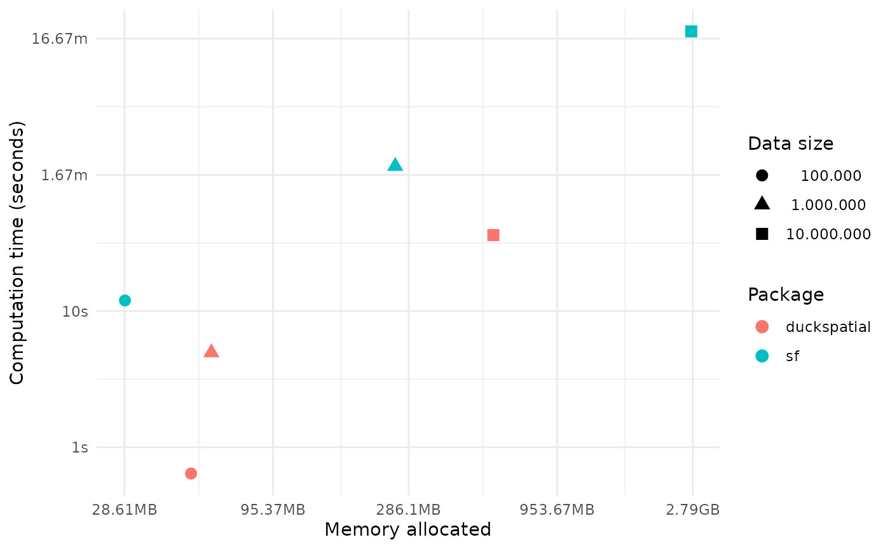
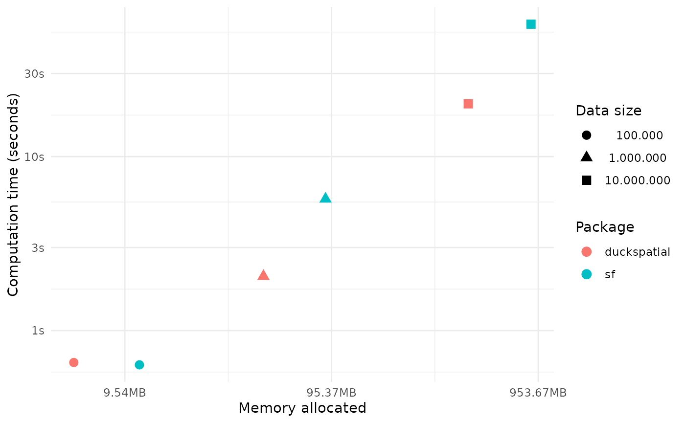
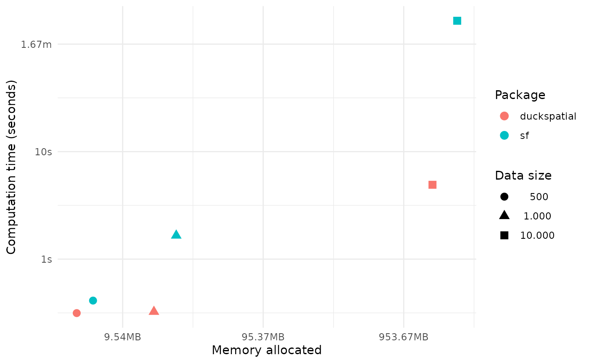

```{r}
#| include: false

# Limit threads to avoid a CRAN NOTE
Sys.setenv(OMP_THREAD_LIMIT = 2)
```

This vignette benchmarks **{duckspatial}** against **{sf}** across several
spatial operations, comparing computation time and memory usage as dataset size
grows. We plan to extend it with additional operation types in future releases.

## TL;DR

{duckspatial} is substantially faster and allocates far less memory than {sf}
in almost all cases, with the advantage becoming more pronounced on larger
datasets. The one exception is pairwise distance calculation, where {sf}
retains a memory advantage for Euclidean distances.

## Prepare data

```{r}
#| message: false
#| warning: false
#| code-fold: true
#| code-summary: "Set-up"

library(duckspatial)
library(bench)
library(dplyr)
library(sf)
library(ggplot2)
options(scipen = 999)

# Country polygons (257 features)
countries_sf <- sf::st_read(
  system.file("spatial/countries.geojson", package = "duckspatial")
)

# Random point datasets of increasing size
set.seed(42)

make_points <- function(n) {
  data.frame(
    id = 1:n,
    x  = runif(n, min = -180, max = 180),
    y  = runif(n, min = -90,  max = 90)
  ) |>
    sf::st_as_sf(coords = c("x", "y"), crs = 4326)
}

points_sf_100k <- make_points(10e4)
points_sf_1mi  <- make_points(10e5)
```

# Spatial join

```{r}
#| message: false

run_join_benchmark <- function(points_sf) {
  temp <- bench::mark(
    iterations = 1,
    check      = FALSE,
    duckspatial = duckspatial::ddbs_join(
      x    = points_sf,
      y    = countries_sf,
      join = "within"
    ),
    sf = sf::st_join(
      x    = points_sf,
      y    = countries_sf,
      join = sf::st_within
    )
  )
  temp$n   <- nrow(points_sf)
  temp$pkg <- c("duckspatial", "sf")
  temp
}

df_bench_join <- lapply(
  X   = list(points_sf_100k, points_sf_1mi),
  FUN = run_join_benchmark
) |>
  dplyr::bind_rows()
```

```{r}
#| code-fold: true
#| code-summary: "Figure Code"
#| warning: false

ggplot(data = df_bench_join) +
  geom_point(
    size = 3,
    aes(
      x     = mem_alloc,
      y     = median,
      color = pkg,
      shape = format(n, big.mark = ".")
    )
  ) +
  labs(
    color = "Package",
    shape = "Data size",
    y     = "Computation time (seconds)",
    x     = "Memory allocated"
  ) +
  theme_minimal()
```



Working with 1 million points, {duckspatial} was **95% faster** and used
**18× less memory** than {sf}.

# Spatial filter

```{r}
#| message: false

run_filter_benchmark <- function(points_sf) {
  temp <- bench::mark(
    iterations = 1,
    check      = FALSE,
    duckspatial = duckspatial::ddbs_filter(
      x = points_sf,
      y = countries_sf
    ),
    sf = sf::st_filter(
      x = points_sf,
      y = countries_sf
    )
  )
  temp$n   <- nrow(points_sf)
  temp$pkg <- c("duckspatial", "sf")
  temp
}

df_bench_filter <- lapply(
  X   = list(points_sf_100k, points_sf_1mi),
  FUN = run_filter_benchmark
) |>
  dplyr::bind_rows()
```

```{r}
#| warning: false
#| code-fold: true
#| code-summary: "Figure Code"

ggplot(data = df_bench_filter) +
  geom_point(
    size = 3,
    aes(
      x     = mem_alloc,
      y     = median,
      color = pkg,
      shape = format(n, big.mark = ".")
    )
  ) +
  labs(
    color = "Package",
    shape = "Data size",
    y     = "Computation time (seconds)",
    x     = "Memory allocated"
  ) +
  theme_minimal()
```



Working with 1 million points, {duckspatial} was **97% faster** and used
**21× less memory** than {sf}.

# Spatial distances

Note that this benchmark uses spherical (Haversine) distances for
{duckspatial} and Great Circle distances for {sf}. {sf} retains a memory
advantage when computing Euclidean distances.

```{r}
#| message: false

sf::sf_use_s2(TRUE)

run_distance_benchmark <- function(n) {
  set.seed(42)
  points_sf <- make_points(n)

  temp <- bench::mark(
    iterations = 1,
    check      = FALSE,
    duckspatial = duckspatial::ddbs_distance(
      x         = points_sf,
      y         = points_sf,
      dist_type = "haversine"
    ),
    sf = sf::st_distance(
      x     = points_sf,
      y     = points_sf,
      which = "Great Circle"
    )
  )
  temp$n   <- n
  temp$pkg <- c("duckspatial", "sf")
  temp
}

df_bench_distance <- lapply(
  X   = c(500, 1000, 10000),
  FUN = run_distance_benchmark
) |>
  dplyr::bind_rows()
```

```{r}
#| warning: false
#| code-fold: true
#| code-summary: "Figure Code"

ggplot(data = df_bench_distance) +
  geom_point(
    size = 3,
    aes(
      x     = mem_alloc,
      y     = median,
      color = pkg,
      shape = format(n, big.mark = ".")
    )
  ) +
  labs(
    color = "Package",
    shape = "Data size",
    y     = "Computation time (seconds)",
    x     = "Memory allocated"
  ) +
  theme_minimal()
```



Calculating pairwise distances between 10K points, {duckspatial} was **87%
faster** but used **3× more memory** than {sf}.
